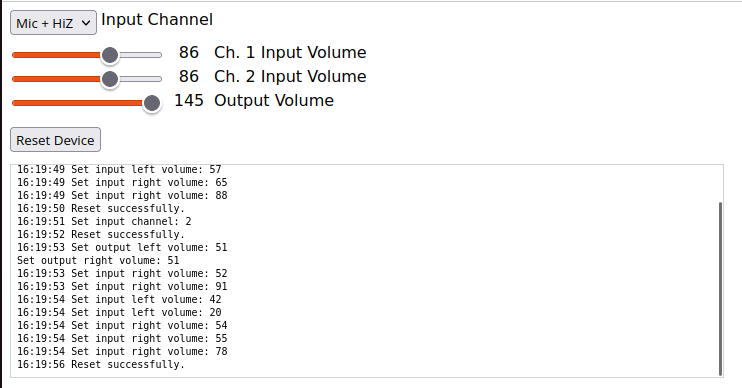

# ESI Maya 22 Web Control

> :warning: This repository is not actively maintained. I don't own the interface anymore, I wrote this software for a friend whom I gave the Maya. If you're interested in using it, please fork it.

Simple, browser-based GUI to control the ancient ESI Maya 22 USB audio interface on Linux.

## Installation

-   `Node.js` must be installed
-   Build the command line Maya22 control app by `rabits`: Follow instructions on https://github.com/rabits/esi-maya22-linux
-   Clone this repository
-   Install dependencies: `npm install`
-   Create a file containing the path to the control app executable named `.clipath`
    -   Example content: `/usr/local/bin/maya22-control`
-   `npm start`
    -   You can expose the server to your network by running `npm run network`
-   Now you can open the web GUI at http://localhost:9999
